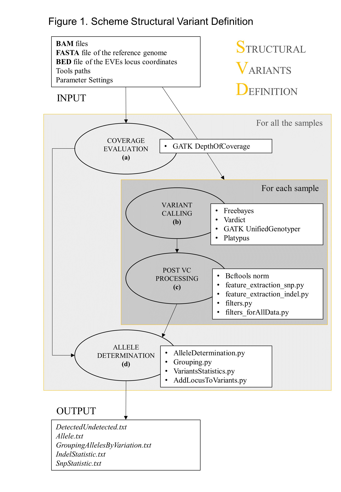

# SVD
Pipeline developped by Elisa Pischedda, while in the Bonizzoni Lab at the University of Pavia (Italy).

## Purpose
The Structural Variants Definition (SVD) pipeline is designed to study the polymorphism of Endogenous Viral Elements (EVEs) or any other given sequences annotated in a reference genome assembly. Starting from WGS data aligned on the reference assembly, the pipeline describes the variability of the annotated EVEs both in terms of their presence/absence and their sequence (SNPs, INDELS). The pipeline can be applied to WGS data from one individual, or alternatively to WGS data from multiple samples, hereafter called population.
The pipeline is divided into four main steps. In case of a population, the first and the last step are evaluated considering all samples at the same time, while the intermediate steps are evaluated separately for each sample.
All input requirements of the pipeline are settable in one command line. Input requirements include the sample file, the pipeline directory, the output directory, the reference files (i.e. the genome of the studied organisms in FASTA and the coordinates of the loci of interest in BED), the position of the required tools and input parameters of the tools. The sample file includes the list of the alignment files of the WGS raw data in the reference genome (Binary Alignment Map file, BAM file). 
In the first step, the ‘DepthOfCoverage’ function of the GATK tool [103] is used to evaluate the coverage of the regions of interest limiting to reads with Phred mapping quality greater than the threshold set by the user. In the second step, four different Variant Callers are implemented to identify SNPs and INDELs within the regions of interest. The chosen Variant Caller are GATK UnifiedGenotyper, Freebayes, Platypus , and Vardict, are implemented to identify SNPs and INDELs within the regions of interest. The search of SNPs and INDELS by different variant callers allows to increase the pool of variants and reduce the number of false positive. In the third step, the ‘Bcftools norm’ function is used to split multi-allelic variants calls into multiple records and simultaneously, to implement the left alignment of the INDEL variants. The resulting VCF files from each Variant Caller are then manipulated be able to compare results. Despite the VCF file is a standard format for genomic variants calling, sometimes variant callers indicate the same parameter with different names (i.e. the number of reads supporting the variant in Freebayes is named Alternate Observation [AO], in Vardict and GATK is named Allelic Depth [AD], in Platypus is named Number of Variant reads [NV]). Data from different callers are homogenized in a list of features with the feature extraction step, which is implemented separately for SNPs and INDELs. For each variant, features are either extracted from the VCF file or evaluated using available values.



## Installation

SVD is provided as a ready-to-use set of scripts (Python, R), a shell wrapper and a folder containing examples of the input files required. The package can just be downloaded from GitHub with the command:
```$ git clone https://github.com/freebayes/freebayes.git```

### Dependencies
SVD was tested in the Ubuntu 16.04 LTS and 18.04 LTS Linux environments and uses the following programs which need to be installed and have their path reported as values of the input parameters of the wrapper script.

* PYTHON (https://www.python.org)
* GATK (https://gatk.broadinstitute.org/hc/en-us)
* Platypus (https://www.well.ox.ac.uk/research/research-groups/lunter-group/lunter-group/platypus-a-haplotype-based-variant-caller-for-next-generation-sequence-data)
* Frebayes (https://github.com/freebayes/freebayes)
* VarDict (https://github.com/AstraZeneca-NGS/VarDict)
* BCFtools (http://www.htslib.org/download/)


- - - -

<br>

## Files preparation

Needed:

1. __A list of bam file (.list)__. A list of BAM files generated by the alignment of the raw reads of the samples against the host reference genome. Files should be sorted. Multiple samples from the same or different populations can be included in the list.
Example:  ```'./Example_files/BAM_Samples.list' ```

2. __A bed and a platypus txt file of the EVEs annotation (.bed, .txt)__ containing their coordinates. GATK, Freebayes and VarDict will use the bed files, while platypus required a modified file in which each feature is annotated with the format: scaffold:start-end.
Examples:  ```'./Example_files/EVEs_181203.bed' ``` and  ```'./Example_files/EVEs_181203.txt' ```.

3. __Reference assembly (FASTA)__ in fasta format. This must be the same genome assembly to which the annotations in the bed and txt files refer to.


- - - -

<br>

## Usage
SVD can be run using the  ```'StructuralVariantDefinition.sh'``` shell wrapper. The user must provide a single command line including all the information required by the pipeline:

```sh
$ bash StructuralVariantDefinition.sh \
-c samples_BAM_files.list \
-b reference_EVEs.bed \
-b_pl platypus_EVEs.txt \
-f reference_genome_assembly.fa \
-i /StructuralVariantsDefinition_09_11_18 \
-o /output_folder \
-fbpath /freebayes/bin/freebayes \
-gkpath gatk.jar \
-vdpath /VarDict/vardict \
--fileR /VarDict/teststrandbias.R \
--filePl /VarDict/var2vcf_valid.pl \
-plpath /Platypus/bin/Platypus.py \
-btpath /bcftools/bcftools \
-th 4 --ram 12g --MIN_MQ 20 --MIN_BQ 20 --MIN_AF 0.1 --MIN_AO 2 --MIN_COV 8 --MAX_DEPTH 5000 \
--DP_expected_mean 20 \
-dp 8 -af 0.1 \
--AFallData 0.1 --MaxStrBias 0.01 --MinLengthINDELallData 6 --NumCallersallData 2 --minReadsAllDef 5 --minLengthAllele 30 --thresholdSimilarity 0.05 &
```

### Parameters

Fill the appropriated parameter values; absolute paths will allow to run SVD from any directory.

| Parameter                  | Description                                                                                                                                |
|----------------------------|--------------------------------------------------------------------------------------------------------------------------------------------|
| -c\|\-\-configsample)        | path of the   configuration file including the list of samples. One per raw, each sample is   represented by its id and its BAM path file. |
| -i\|\-\-filepath)            | path of the pipeline directory (i.e.   /AbsPathTo/StructuralVariantsDefinition/)                                                           |
| -o\|\-\-output)              | path of the output   directory                                                                                                             |
| -b\|\-\-bedfile)             | path of the bed file including contig start   stop name of the loci of interest                                                            |
| -b_pl\|\-\-bedfile_platypus) | path of the platypus bed file including   contig start stop name of the loci of interest                                                   |
| -f\|\-\-fasta)               | path of the fasta file   of the reference genome                                                                                           |
| -fbpath\|\-\-freebayespath)  | Path of Freebayes                                                                                                                          |
| -gkpath\|\-\-gatkpath)       | Path of GATK                                                                                                                               |
| -vdpath\|\-\-vardictpath)    | Path of VarDict                                                                                                                            |
| \-\-fileR)                   | Path of VarDict/teststrandbias.R                                                                                                        |
| \-\-filePl)                  | Path of VarDict/var2vcf_valid.pl                                                                                                          |
| -plpath\|\-\-platypuspath)   | Path of Platypus                                                                                                                           |
| -btpath\|\-\-bcftoolspath)   | Path of bcftools                                                                                                                           |
| -th\|\-\-threads)            | number of threads                                                                                                                          |
| -R\|\-\-ram)                 | ram to use in variant calling for GATK (es. 3g)                                                                                          |
| \-\-MIN_MQ)                  | minimum phred mapping quality to call a variant                                                                                          |
| \-\-MIN_BQ)                  | minimum phred base quality to call a variant                                                                                               |
| \-\-MIN_AF)                  | minimum allele frequency to call a variant                                                                                                 |
| \-\-MIN_AO)                  | minimum allele observations to call a variant                                                                                              |
| \-\-MIN_COV)                 | minimum depth of coverage to call a variant                                                                                                |
| \-\-MAX_DEPTH)               | maximum depth of coverage to call a variant                                                                                              |
| \-\-DP_expected_mean)        | mean of the read coverage in the sample                                                                                                  |
| -af\|\-\-minallfreq)         | minimum allele frequency to call a variant                                                                                                 |
| -dp\|\-\-mindepth)           | minimum depth of coverage to call a variant                                                                                              |
| \-\-AFallData)               | minimum allele frequency to include variant   in the output                                                                                |
| \-\-MaxStrBias)              | maximum strand bias to include variant in the   output                                                                                     |
| \-\-MinLengthINDELallData)   | length of the INDEL to include variant in the   output                                                                                     |
| \-\-NumCallersallData)       | number of callers that have to simultaneously   call a variant for it to be accepted                                                       |
| \-\-minReadsAllDef)          | minimum number of reads coverage to consider   an allele present                                                                           |
| \-\-minLengthAllele)         | minimum number of consecutive nucleotides to   define an allele                                                                            |
| \-\-thresholdSimilarity)     | maximum percentage of the annotated sequence length to consider two alleles equal                                                        |

<br>

### Output

The final step of the pipeline produces in output:
* the list of nrEVEs detected in each sample;
* for each nrEVE, the list of SNPs and INDELs detected in each sample;
* for each nrEVE, the list of different alleles found in the samples; 
* a summary table including the previous information.
For each sample in analysis, the summary table shows:
* the number of variants found in each locus;
* the number of variants found in heterozygosity in each locus. If the number of callers that call the variants in heterozygosity is equal or higher than the number of callers that call the variant in homozygosity than the genotype is considered heterozygous. If there is one variant in heterozygosity, the allele genotype is called in heterozygosity.
* the length of the allele;
* the Level of Polymorphism (LoP) defined as follow: LoP=(N_SNPs+N_INDELs)/(Allele_length )
* the structure of the allele defined as follow: start:stopΔstartDel_1:stopDel_1…ΙstartIns_1:stopIns_1
* start and stop are the most external position of the allele with at least the coverage required in input. Symbols Δ,Ι indicate the presence of a deletion or an insertion of at least the INDEL length required in input, respectively. stopΔstartDel_x:stopDel_x and startIns_y:stopIns_y are the coordinates for the start and the stop of the deletion x and the insertion y. start_del, stop_del and start_ins refer to the position of the variant according to the reference genome. Instead, stop_ins is an artificial value evaluated as start_ins+length(insertion).

- - - -

<br>

## Additional information about the variant calling process

### Variant callers output homogenization

Features are extracted from the VCF files of each Variant Caller and homogenized to give comparable results. Values of the features are directly drawn in the feature extraction output file if present in the VCF file; otherwise features are evaluated with the drawn feature values when possible.

| Features   | Freebayes | Platypus  | GATK      | Vardict   | Complete feature name                                                                   |
|------------|-----------|-----------|-----------|-----------|-----------------------------------------------------------------------------------------|
| GT         | Drown     | Drown     | Drown     | Drown     | Genotype                                                                                |
| AO         | Drown     | Drown     | Drown     | Drown     | Alternate observations                                                                  |
| RO         | Drown     | Evaluated | Drown     | Drown     | Reference observations                                                                  |
| AO_f       | Drown     | Drown     | .         | Drown     | Alternate observations forward                                                          |
| AO_r       | Drown     | Drown     | .         | Drown     | Alternate observations reverse                                                          |
| RO_f       | Drown     | Evaluated | .         | Drown     | Reference observations forward                                                          |
| RO_r       | Drown     | Evaluated | .         | Drown     | Reference observations reverse                                                          |
| DP         | Drown     | Drown     | Drown     | Drown     | Depth of coverage                                                                       |
| DP_f       | Evaluated | Drown     | .         | Evaluated | DP reads forward                                                                        |
| DP_r       | Evaluated | Drown     | .         | Evaluated | DP reads reverse                                                                        |
| AF         | Evaluated | Evaluated | Evaluated | Evaluated | Allele frequency                                                                        |
| StrandBias | Evaluated | Evaluated | Evaluated | Evaluated | Strand bias                                                                             |
| MQ0F       | .         | .         | .         | .         | Fraction of reads with mapping quality 0                                                |
| MQ0        | .         | .         | Evaluated | .         | Number of reads with mapping quality 0                                                  |
| MQRankSum  | .         | .         | Evaluated | .         | Zscore WilcoxonRankSumTest of Alt VS Ref   mapping/base qualities                       |
| BQRankSum  | .         | .         | Evaluated | .         |                                                                                         |
| BQ         | Evaluated | .         | .         | Drown     | Base quality                                                                            |
| Call       | 1/0       | 1/0       | 1/0       | 1/0       | If the caller recognizes   a variant the call feature is set to 1 otherwise is set to 0 |

### Features description

The following features are considered:
* GT: the genotype of the variant identified by the caller. Variants showing genotype 0/0 are filter out as they are false positive variants (they are in homozygosity with the reference). Genotypes 0/1 and 1/0, were rewrite as 1 as they imply heterozygosity with respect to the reference and the genotype 1/1 was rewritten as 2 as it implies variant in homozygosity.
* AO: Alternate Observation is the number of reads supporting the variant allele.
* RO: Reference Observation is the number of reads supporting the reference allele.
* AO_f: AO forward is the number of forward reads (5'-3') supporting the variant allele. 
* AO_r: AO reverse is the number of reverse reads (3'-5') supporting the variant allele.
* RO_f: RO forward is the number of forward reads (5'-3') supporting the reference allele.
* RO_r: RO reverse is the number of reverse reads (3'-5') supporting the reference allele.
* DP: depth of coverage is the total number of reads supporting a nucleotide.
* DP_norm: depth of coverage of the variant position normalized with respect to the mean number of reads coverage given in input.
* DP_f: depth of coverage forward is the total number of forward reads (5'-3') supporting a nucleotide. 
* DP_r: depth of coverage reverse is the total number of reverse reads (3'-5') supporting a nucleotide
* AF: allele frequency is the ratio between the number of reads supporting the variant allele and the total number of reads supporting the nucleotide in which the variant occurs (AF=AO/DP).
* StrandBias: index of the fraction of reads supporting the variant in the two directories forward (5'-3') and reverse (3'-5'). In case of total absence of reads in one direction some alignment error could occur, thus, these variants have to be filtered out. The value of the strand bias, showed in the feature extraction output file, is evaluated as Fisher score, after implementing the Fisher Exact Test. The resulting value ranges from 0 to 1. When the value tends to 0 there is not strand bias; when the value tends to 1 there is presence of strand bias. Strand bias is evaluated with RO_f, RO_r, AO_f and AO_r. The GATK VCF file does not contain RO_f, RO_r, AO_f and AO_r values, but it includes PhredFS that is the Phred scale Pvalue of the Fisher exact test. To make results comparable among callers, PhredFS was converted with the following formula: StrBiasFS= 1-pow(10,-PhredFS/10)
* MQ0 and MQ0F are the number and the frequency of the reads with mapping quality 0, respectively. Available only for GATK.
* BQRankSum: the Zscore WilcoxonRankSumTest evaluates if there is statistical difference between the base quality of the reads supporting the reference and the base quality of the reads supporting the variant allele. The variant may be an artifact if there is bias in the base quality distribution.
* MQRankSum: the Zscore WilcoxonRankSumTest evaluates if there is statistical difference between the mapping quality of the reads supporting the reference and the mapping quality of the reads supporting the variant allele. 
* QB: base quality is the mean of the base quality of the reads supporting the alternate variant. Available only for Freebayes e Vardict.
* Call: if the flag is 1, it means that the caller found the variant. It is available for each of the four Variant Callers implemented.

In addition, Mean and median of the Allele frequency, the Depth of coverage and the Strand Bias are evaluated.

<br>

### Variant callers input parameters

Not all the callers allow the usage of all the parameters setting in input (i.e. the Min Coverage parameter is available just for Freebayes and Alternate Fraction is available just for Freebayes and Vardict). To compensate the missing application of filters by some variant callers, the pipeline uses a further filter step. In particular, variants with allele fraction (AF) less than the minimum AF or with depth of coverage (DP) less than the minimum DP required by the user are excluded.
Here are the parameters in input of each variant caller used:

| Freebayes                | Platypus      | GATK          | Vardict |
|--------------------------|---------------|---------------|---------|
| \-\-min-mapping-quality    | \-\-minMapQual  | /             | /       |
| \-\-min-base-quality       | \-\-minBaseQual | \-\-min_base_   | /       |
|                          |               | quality_score |         |
| \-\-min-alternate-count    | \-\-minReads    | /             | /       |
| \-\-min-alternate-fraction | /             | /             | -f      |
| \-\-min-coverage           | /             | /             | /       |

<br>
- - - -
<br>
